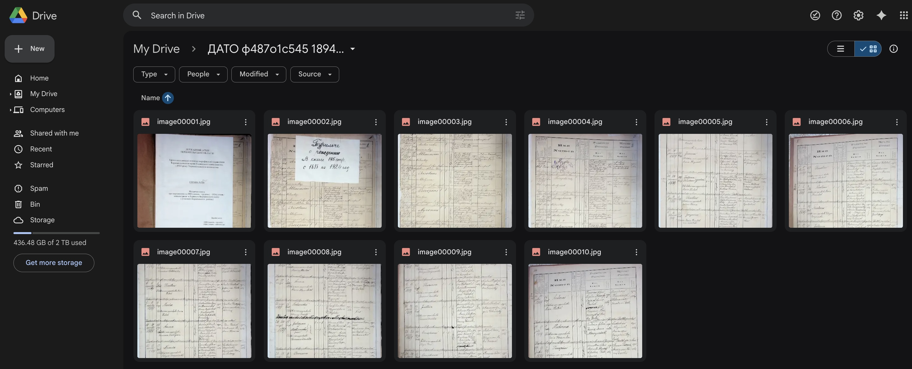
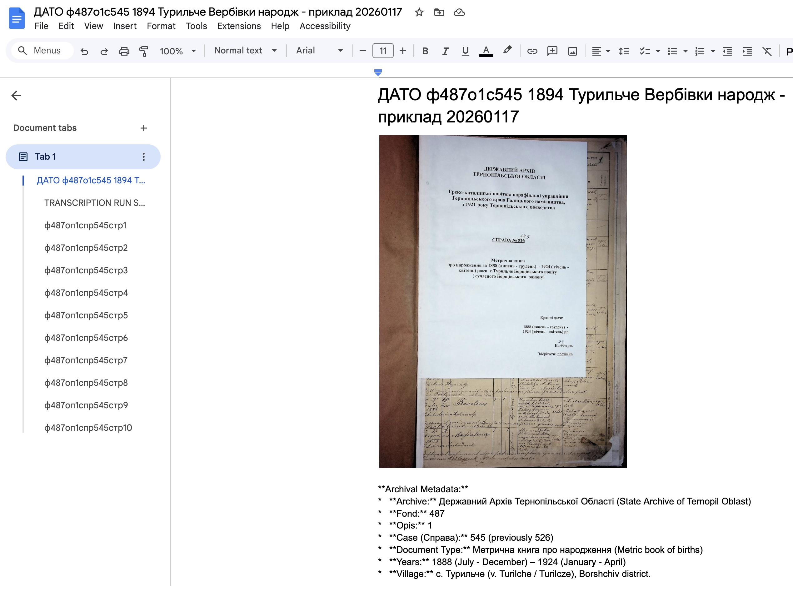
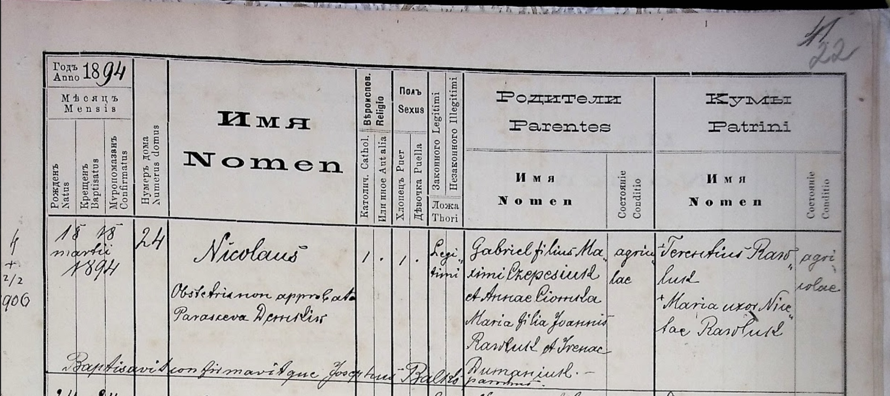

# Genea Metric Books Transcriber Scripts

This toolkit transcribes images of handwritten records from metric books using Google's Gemini AI models. The tool supports **two operation modes**:

- **LOCAL Mode**: Process images from your local file system using Gemini Developer API (no Google Cloud setup required)
- **GOOGLECLOUD Mode**: Process images from Google Drive using Vertex AI and write results to Google Docs (original functionality)

A recovery script can rebuild the Google Doc from AI logs if the main run fails late.

## Overview

A specialized tool for transcribing handwritten genealogical records (birth, death, and marriage certificates) from 19th and 20th century Eastern European archives. The script automates the process of extracting structured data from historical documents using Google's latest Gemini AI vision models.

### Quick Start

**For LOCAL Mode (Simplest Setup):**
1. Get a Gemini API key from [Google AI Studio](https://aistudio.google.com/app/apikey)
2. Set environment variable: `export GEMINI_API_KEY="your-key"`
3. Copy example config: `cp config/config.local.example.yaml config/my-config.yaml`
4. Edit config with your image directory path
5. Run: `python3 transcribe.py config/my-config.yaml`

**For GOOGLECLOUD Mode (Full Features):**
1. Set up Google Cloud project with required APIs
2. Authenticate using gcloud ADC or OAuth
3. Copy example config: `cp config/config.googlecloud.example.yaml config/my-config.yaml`
4. Edit config with your Drive folder ID
5. Run: `python3 transcribe.py config/my-config.yaml`

See [Configuration](#configuration) section for detailed setup instructions.

### Key Features

- **Dual-Mode Operation**: Choose between LOCAL mode (simpler setup, local files) or GOOGLECLOUD mode (full Google integration)
- **Flexible Image Processing**: Supports multiple filename patterns (numbered, timestamped, prefixed)
- **Configurable Prompts**: Uses external prompt files for different record types (births, deaths, marriages)
- **Batch Processing**: Process specific ranges of images with configurable start/count parameters
- **Multiple Output Formats**: 
  - **LOCAL Mode**: Log files with transcriptions and session metadata
  - **GOOGLECLOUD Mode**: Google Docs with formatted transcriptions, metadata, headings, and source links
- **Incremental Document Writing** (GOOGLECLOUD mode): Creates Google Doc after first batch, then appends subsequent batches incrementally for resilience
- **Smart Error Recovery**: Automatic retries with exponential backoff, local file fallback, and resume information
- **Comprehensive Logging**: Separate logs for script progress and AI responses
- **Retry Mechanism**: Reprocess specific failed images without re-running entire batch
- **Rate Limiting**: Built-in protection against API quota exhaustion

### Example: Input → Output

**Input: Google Drive Folder** (Images of historical metric book records):



The script processes images from a Google Drive folder containing scanned pages from historical metric books (birth, death, and marriage records).

**Output: Complete Transcription Document** - [ДАТО ф487о1с545 1894 Турильче Вербівки народж.pdf](data_samples/ДАТО%20ф487о1с545%201894%20Турильче%20Вербівки%20народж.pdf) - Example of a complete transcribed document exported from Google Docs.

**Output: Google Doc Title Page** (Document header with title page image and transcription):



The script creates a Google Doc with:
- Document title with transcription date
- Title page image (if configured) with its transcription
- Transcription run summary with metadata

**Output: Transcribed Record** (Structured multilingual transcription):


Each record is transcribed in **Russian, Ukrainian, and Latin**, preserving:
- Names, dates, and relationships
- Historical context from the original handwritten document
- Clickable links to source images
- Archive references (if configured)

**Sample Input Record** (19th century Latin metric book record):



**Sample Output Transcription** (Text format):

```
Год 1894
Державний Архів Тернопільської Області - Ф. 487, оп. 1, спр. 545
Страница 22

---

### Запись 1: Николай Чепесюк
Турильче (?), дом 24
Николай Чепесюк (род. 18/03/1894)
Родители: Гавриил Чепесюк (сын Максимилиана Чепесюка и Анны Чомулы) и Мария 
  (дочь Ивана Павлюка и Ирины Романюк).
Кумы: Терентий Павлюк и Мария, жена Николая Павлюка.
Заметка: Крестил священник Иосиф Балко. Повитуха Параскева Демкив.

Турильче (?), будинок 24
Микола Чепесюк (нар. 18/03/1894)
Батьки: Гаврило Чепесюк (син Максиміліана Чепесюка та Анни Чомули) та Марія 
  (дочка Івана Павлюка та Ірини Романюк).
Куми: Терентій Павлюк та Марія, дружина Миколи Павлюка.
Замітка: Хрестив священик Йосип Балко. Баба-повитуха Параскева Демків.

Turilcze, domus 24
18 18 Martii 1894 | domus 24 | Nicolaus | Catholicus | Puer | Legitimi |
Parentes: Gabriel filius Maximiliani Czepesiuk et Annae Ciomula; 
  Maria filia Joannis Pawluk et Irenae Romanjuk. agricolae.
Patrini: Terentius Pawluk et Maria uxor Nicolai Pawluk. agricolae.
Notes: Obstetrix non approbata Parasceva Demkiw. 
  Baptisavit confirmavitque Josephus Balko parochus.
```

The AI model extracts and transcribes the same record in **Russian, Ukrainian, and Latin**, preserving names, dates, relationships, and historical context from the original handwritten document.

### Architecture & Technical Details

> **📐 Technical Documentation**: For detailed architecture diagrams, workflow sequences, component details, and dual-mode architecture information, see [docs/ARCHITECTURE.md](docs/ARCHITECTURE.md).

The tool uses a **Strategy pattern architecture** to support dual-mode operation:
- **LOCAL Mode**: Processes images from local file system using Gemini Developer API
- **GOOGLECLOUD Mode**: Processes images from Google Drive using Vertex AI

Key components:
- **ModeFactory**: Creates mode-specific handlers based on configuration
- **Strategy Interfaces**: Authentication, Image Sources, AI Clients, Output
- **Automatic Mode Detection**: Analyzes configuration to determine operation mode
- **Unified Processing Logic**: Shared code with mode-specific implementations

See the [Architecture Documentation](docs/ARCHITECTURE.md) for:
- Detailed architecture diagrams
- Workflow sequence diagrams for both modes
- Component details and technology stack
- Strategy pattern implementation details

## Prerequisites

### Common Requirements (Both Modes)
1. Python 3.10+
2. Install dependencies: `pip install -r requirements.txt`

### LOCAL Mode Prerequisites
1. **Gemini API Key**: Get your API key from [Google AI Studio](https://aistudio.google.com/app/apikey)
2. **Local Image Directory**: Prepare a directory with images to transcribe
3. **No Google Cloud setup required** - just the API key!

### GOOGLECLOUD Mode Prerequisites
1. **Google Cloud project** (e.g., `ukr-transcribe-genea`) with APIs enabled:
   - Vertex AI API
   - Google Drive API
   - Google Docs API
2. **Authentication** (pick one):
   - **gcloud ADC** (recommended):
     ```bash
     gcloud auth application-default login --project=<PROJECT_ID> \
       --scopes=https://www.googleapis.com/auth/drive,\
       https://www.googleapis.com/auth/documents,\
       https://www.googleapis.com/auth/cloud-platform
     ```
     This writes `application_default_credentials.json` used by the scripts.
   - **OAuth client** via built-in helper:
     - Place your OAuth client as `client_secret.json` in the project root.
     - Run `python refresh_credentials.py` (generates `application_default_credentials.json`).
3. **Drive access**:
   - Share the target Drive folder (configured via `drive_folder_id` in config) with the same Google account that authenticated (Editor).

## Installation

```bash
cd /Users/<you>/repos/personalprojects/genea_gcloud_gemini_transcriber
python3 -m venv venv
source venv/bin/activate
pip install -r requirements.txt
```

## Configuration

> **📖 Detailed Configuration Guide**: See [docs/CONFIGURATION.md](docs/CONFIGURATION.md) for comprehensive configuration options and examples.  
> **🔄 Migrating from Legacy Config?**: See [docs/MIGRATION.md](docs/MIGRATION.md) for step-by-step migration instructions.

### Mode Selection

The tool supports two operation modes:

- **LOCAL Mode**: Process images from local file system, output to log files
  - **Best for**: Quick testing, local processing, no Google Cloud setup
  - **Setup**: Just need Gemini API key
  - **Output**: Log files with transcriptions

- **GOOGLECLOUD Mode**: Process images from Google Drive, output to Google Docs
  - **Best for**: Production use, collaborative workflows, Google integration
  - **Setup**: Requires Google Cloud project and authentication
  - **Output**: Formatted Google Docs with links and metadata

The mode is automatically detected from your configuration, or you can explicitly set `mode: "local"` or `mode: "googlecloud"`.

### 1. Prepare Prompt File

Before configuring the script, create or select a prompt file in the [`prompts/`](prompts/) folder. The prompt file defines the transcription instructions, village names, and common surnames for your specific metric book.

**Note:** Use one of the existing prompt samples as a template and adjust it for your use case:
- [`NIWRA_f487o1s47.md`](prompts/NIWRA_f487o1s47.md) - Example for Niwra village birth records (1860-1876)
- [`f487o1s545-Turilche.md`](prompts/f487o1s545-Turilche.md) - Example for Turilche village birth records (1888-1924)

Customize Context section of the prompt with:
- Village names specific to your metric book
- Common surnames found in those villages
- Date ranges and archive references
- Record type (births, deaths, marriages)

### 2. Configure Script Parameters

#### LOCAL Mode Configuration

Create a configuration file using the LOCAL mode template:

```bash
cp config/config.local.example.yaml config/my-local-project.yaml
```

Edit `config/my-local-project.yaml`:

```yaml
# Set mode explicitly (optional - auto-detected if local section present)
mode: "local"

# LOCAL mode configuration
local:
  # API key (or use GEMINI_API_KEY environment variable - recommended)
  api_key: "your-api-key-here"  # Get from https://aistudio.google.com/app/apikey
  
  # Local directory containing images
  image_dir: "/path/to/your/images"
  
  # Output directory for log files (optional, default: "logs")
  output_dir: "logs"
  
  # OCR Model ID (optional, default: "gemini-1.5-pro")
  ocr_model_id: "gemini-1.5-pro"

# Shared configuration (applies to both modes)
prompt_file: "f487o1s545-Turilche.md"
archive_index: "ф487оп1спр545"
image_start_number: 1
image_count: 10
retry_mode: false
retry_image_list: []
```

**Security Note**: For better security, use the `GEMINI_API_KEY` environment variable instead of putting the API key in the config file:
```bash
export GEMINI_API_KEY="your-api-key-here"
```

#### GOOGLECLOUD Mode Configuration

Create a configuration file using the GOOGLECLOUD mode template:

```bash
cp config/config.googlecloud.example.yaml config/my-project.yaml
```

Edit `config/my-project.yaml`:

```yaml
# Set mode explicitly (optional - auto-detected if googlecloud section present)
mode: "googlecloud"

# GOOGLECLOUD mode configuration
googlecloud:
  project_id: "ukr-transcribe-genea"
  drive_folder_id: "<your_drive_folder_id>"
  region: "global"
  ocr_model_id: "gemini-3-flash-preview"
  adc_file: "application_default_credentials.json"
  document_name: "<your_document_name>"  # Optional
  title_page_filename: "title_page.jpg"  # Optional

# Shared configuration
prompt_file: "f487o1s545-Turilche.md"
archive_index: "ф487оп1спр545"
image_start_number: 1
image_count: 120
batch_size_for_doc: 10  # GOOGLECLOUD mode only
max_images: 1000  # GOOGLECLOUD mode only
retry_mode: false
retry_image_list: []
```

#### Legacy Configuration Format

The tool also supports the legacy flat configuration format for backward compatibility. See `config/config.yaml.example` for the legacy format. The tool will automatically detect and convert legacy configs to the new format.

**Archive Index (`archive_index`):** Optional condensed archive reference used for:
- Document page headers (format: `{archive_index}стр{page_number}`, e.g., "ф201оп4Aспр350стр22")
- Clickable archive references appended to record headers (lines starting with `###`)
- Overview section metadata

If not set, the script falls back to using image filenames for headers. The format should be: `ф[FOND]оп[OPIS]спр[DELO]` (e.g., "ф487оп1спр545" for Fond 487, Opis 1, Delo 545).

**Filename patterns supported:**
- `image (N).jpg/jpeg` (e.g., `image (7).jpg`)
- `imageNNNNN.jpg/jpeg` (e.g., `image00101.jpg`)
- `NNNNN.jpg/jpeg` (e.g., `216.jpg`)
- `image - YYYY-MM-DDTHHMMSS.mmm.jpg/jpeg`
- `PREFIX_NNNNN.jpg/jpeg` (e.g., `004933159_00216.jpeg`)

If no numeric/timestamp match is found, the script falls back to selecting by position (based on sorted listing).

## Usage

### LOCAL Mode

```bash
source venv/bin/activate
# Set API key via environment variable (recommended)
export GEMINI_API_KEY="your-api-key-here"
python3 transcribe.py config/my-local-project.yaml
```

The script will:
- List images from the local directory
- Process each image sequentially
- Send each image to Gemini Developer API for transcription
- Write transcriptions to log files in the output directory
- Log AI responses to `logs/<timestamp>-ai-responses.log`
- Create a session summary at the end

### GOOGLECLOUD Mode

```bash
source venv/bin/activate
python3 transcribe.py config/my-project.yaml
```

The script will:
- List images from the Google Drive folder
- Process images in batches (configurable via `batch_size_for_doc` in config)
- Download and send each image to Vertex AI for transcription
- Create a Google Doc after the first batch completes, then append subsequent batches incrementally
- Log AI responses to `logs/<timestamp>-ai-responses.log`
- On failure, log resume information (next `image_start_number` to continue from)

## Output

### LOCAL Mode Output

- **Log files** in the output directory (default: `logs/`):
  - `transcription_<timestamp>.log` - Main transcription log with:
    - Session metadata (start time, mode, configuration)
    - Transcriptions for each image with source file paths
    - Session summary with metrics (total images, success count, errors)
  - `logs/<timestamp>-ai-responses.log` - Full AI responses per image

Each transcription entry includes:
- Image source path
- Transcribed text
- Processing metadata (timestamp, model used)

### GOOGLECLOUD Mode Output

- **Google Doc** per run with:
  - Document header with date (format: "{document_name} {YYYYMMDD}")
  - Title page image (if `title_page_filename` is specified in config) inserted under the header
  - Page header: Archive index + page number (e.g., "ф201оп4Aспр350стр22") if `archive_index` is set, otherwise image filename
  - Clickable source image link (format: "Src Img Url: {image_name}")
  - Raw transcription text with clickable archive references on record headers (lines starting with `###`)
  - Overview section with folder link, archive index, and processing metadata

- **Logs**:
  - `transcription_*.log` (script progress)
  - `logs/*-ai-responses.log` (full AI responses per image, including archive index in session config)

## Error Handling and Retry Logic

The script includes comprehensive error handling with automatic retries and exponential backoff for API calls:

### Vertex AI API Timeouts and Retries
- **Initial timeout**: 1 minute (60 seconds)
- **Retry attempts**: 3 total attempts with exponential backoff
- **Timeout progression**: 1 min → 2 min → 5 min
- **Retry delay**: 30 seconds between attempts (doubles with each retry)
- Handles `TimeoutError`, `ConnectionError`, and `OSError` with automatic retries

### Google Docs API Timeouts and Retries
- **Base timeout**: 5 minutes (300 seconds) configured for all Google Docs API calls
- **Overview update retries**: 3 attempts with exponential backoff for updating the TRANSCRIPTION RUN SUMMARY section
- **Timeout progression**: 1 min → 2 min → 5 min
- **Retry delay**: 30 seconds between attempts (doubles with each retry)
- Handles `TimeoutError`, `HttpError`, `ConnectionError`, and `OSError` with automatic retries

### Error Recovery
- Failed API calls are automatically retried with increasing timeouts
- All retry attempts are logged with attempt numbers and elapsed times
- If all retries are exhausted, the script logs detailed error information and continues to the next image
- Resume information is logged on failures, indicating the correct `image_start_number` to use for resuming

## Troubleshooting

### Authentication / OAuth Issues

#### 403 access_denied or "app not verified"
- If using OAuth client and you see “app not verified” / `access_denied`, either add your account as a Test User on the OAuth consent screen or use the gcloud ADC method (recommended).

#### Token expired or invalid_grant errors
- **Verify OAuth client file**: Ensure `client_secret.json` belongs to the correct Google Cloud project and matches the Google account you're authenticating with. Using a client secret from a different project/account will cause authentication failures.
- **Refresh credentials**: Run `python refresh_credentials.py` to generate new credentials.
- **Alternative**: Use gcloud ADC method (see Prerequisites section above) which doesn't require OAuth client files.

#### Vertex AI first call is slow (cold start)
- First call can take minutes. To reduce:
  - Add a warm-up call after client init (tiny text request).
  - Lower `max_output_tokens`, remove/disable thinking config, reduce timeout and add retries.

#### No images found
- Verify `drive_folder_id` in your config file and folder sharing.
- Confirm filenames match supported patterns.
- Use fallback by position via `image_start_number`/`image_count`.

##### Processing interrupted or failed
- The script processes images in batches and writes incrementally to the Google Doc.
- If processing fails, check the logs for "RESUME INFO" messages indicating the next `image_start_number` to use.
- Update `image_start_number` in your config YAML file and re-run to resume from where it left off.
- Completed batches are already saved in the Google Doc, so only the current batch needs to be reprocessed.

##### Google Docs: Precondition check failed / 400 on batchUpdate
- The main script writes in small chunks; if a run still fails late or the Doc is partial, use the Recovery Script below to rebuild from the AI log without re-running transcription.

##### Recovery Script (rebuild GDoc from AI log) - GOOGLECLOUD Mode Only - GOOGLECLOUD Mode Only

If the main script failed after transcription, run:

```bash
source venv/bin/activate
python3 recovery_script.py logs/<your_ai_log>.log --doc-title "transcription_<label>_recovered"
# optionally place into a specific folder
python3 recovery_script.py logs/<your_ai_log>.log --folder-id <DRIVE_FOLDER_ID> --doc-title "transcription_<label>_recovered"
```

The recovery script parses the AI response log, then writes the document per image using small, safe updates to avoid index/range errors.

**Note**: Recovery script is only available for GOOGLECLOUD mode. For LOCAL mode, transcriptions are already saved in log files and can be manually extracted if needed.

## Notes

- For very large runs, chunking is enforced to stay within Google Docs API limits.
- All operations are logged; tail logs for live status:
  - `tail -f transcription_*.log`
  - `tail -f logs/*-ai-responses.log`

## License

This project is licensed under the MIT License - see the [LICENSE](LICENSE) file for details.

## Disclaimer

**Important Legal Notice:**

This software is provided "AS IS", without warranty of any kind. The AI transcription results generated by this tool may contain errors, inaccuracies, or misinterpretations, especially with:
- Handwritten text recognition
- Historical document transcription  
- Name and surname translations
- Date and number extraction

**Users are responsible for:**
- Verifying all transcription results against original source documents
- Validating names, dates, and genealogical information
- Using transcriptions as approximate translations only
- Ensuring compliance with applicable laws and regulations

**The authors and contributors assume no liability for:**
- Errors or inaccuracies in AI-generated transcriptions
- Loss of data or information
- Incorrect genealogical research based on transcriptions
- Any consequences arising from the use of this software

**Use this software at your own risk.** Always verify AI-generated transcriptions with original source documents. The neural network makes many inaccuracies in translating names and surnames - use as an approximate translation of handwritten text and verify with the source!