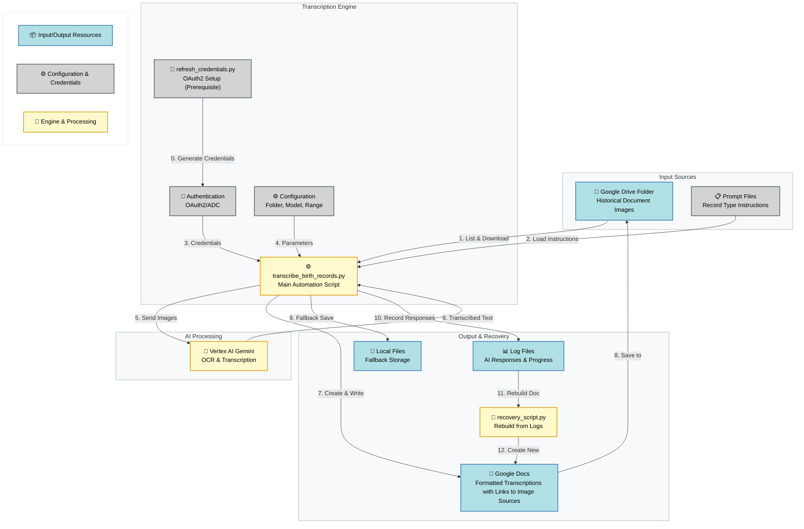
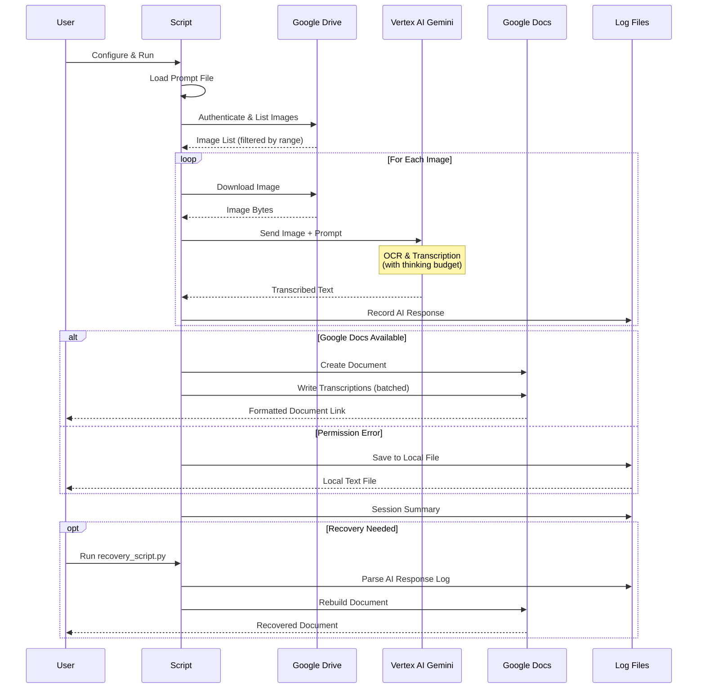

# Genea Google Cloud Gemini Transcriber

This toolkit transcribes images from a Google Drive folder using Vertex AI Gemini 2.5 and writes results into a Google Doc with headings, source links, and raw AI output. A recovery script can rebuild the Google Doc from AI logs if the main run fails late.

## Overview

A specialized tool for transcribing handwritten genealogical records (birth, death, and marriage certificates) from 19th and 20th century Eastern European archives. The script automates the process of extracting structured data from historical documents using Google's latest Vertex AI vision models.

### Key Features

- **Flexible Image Processing**: Supports multiple filename patterns (numbered, timestamped, prefixed)
- **Configurable Prompts**: Uses external prompt files for different record types (births, deaths, marriages)
- **Batch Processing**: Process specific ranges of images with configurable start/count parameters
- **Smart Error Recovery**: Local file fallback when Google Docs API fails
- **Comprehensive Logging**: Separate logs for script progress and AI responses
- **Retry Mechanism**: Reprocess specific failed images without re-running entire batch
- **Test Mode**: Quick validation of authentication and API access
- **Rate Limiting**: Built-in protection against API quota exhaustion
- **Structured Output**: Creates well-formatted Google Docs with metadata, headings, and source links

### Architecture



### Main Workflow



### Component Details

| Component | Purpose | Technology |
|-----------|---------|------------|
| **Image Sources** | Historical document scans | Google Drive folders |
| **OAuth2 Setup** | Generate authentication credentials | refresh_credentials.py |
| **Transcription Engine** | Main automation script | Python 3.10+ |
| **AI Model** | OCR & structured extraction | Vertex AI Gemini 2.5/3 Pro |
| **Output Storage** | Formatted transcriptions | Google Docs API |
| **Fallback Storage** | Local file save on API errors | Text files in logs/ |
| **Logging System** | Progress tracking & recovery | Separate log files |
| **Prompt System** | Record-type specific instructions | External .txt files |
| **Recovery Tool** | Rebuild docs from logs | recovery_script.py |

## Prerequisites

1. Python 3.10+
2. Google Cloud project (e.g., `ukr-transcribe-genea`) with APIs enabled:
   - Vertex AI API
   - Google Drive API
   - Google Docs API
3. Authentication (pick one):
   - gcloud ADC (recommended):
     - `gcloud auth application-default login --project=<PROJECT_ID> --scopes=https://www.googleapis.com/auth/drive,https://www.googleapis.com/auth/documents,https://www.googleapis.com/auth/cloud-platform`
     - This writes `application_default_credentials.json` used by the scripts.
   - OAuth client via built-in helper:
     - Place your OAuth client as `client_secret_ok.json` (or `client_secret.json`).
     - Run `python refresh_credentials.py` (auto-detects `client_secret_ok.json`, generates `application_default_credentials.json`).
4. Drive access:
   - Share the target Drive folder (`DRIVE_FOLDER_ID`) with the same Google account that authenticated (Editor).

## Installation

```bash
cd /Users/<you>/repos/personalprojects/genea_gcloud_gemini_transcriber
python3 -m venv venv
source venv/bin/activate
pip install -r requirements.txt
```

## Configuration

Edit `transcribe_birth_records.py`:

```python
PROJECT_ID = "ukr-transcribe-genea"  # or your project
DRIVE_FOLDER_ID = "<your_drive_folder_id>"
FOLDER_NAME = "<folder_name_for_logs>"
REGION = "global"  # you can also try "us-central1"
TEST_MODE = True
TEST_IMAGE_COUNT = 2
MAX_IMAGES = 1000
IMAGE_START_NUMBER = 1
IMAGE_COUNT = 120
```

Filename patterns supported:
- `image (N).jpg/jpeg` (e.g., `image (7).jpg`)
- `imageNNNNN.jpg/jpeg` (e.g., `image00101.jpg`)
- `NNNNN.jpg/jpeg` (e.g., `216.jpg`)
- `image - YYYY-MM-DDTHHMMSS.mmm.jpg/jpeg`
- `PREFIX_NNNNN.jpg/jpeg` (e.g., `004933159_00216.jpeg`)

If no numeric/timestamp match is found, the script falls back to selecting by position (based on sorted Drive listing).

## Usage

```bash
source venv/bin/activate
python3 transcribe_birth_records.py
```

The script will:
- List images in the folder
- Download and send each image to Vertex AI for transcription
- Create a Google Doc and write results in safe chunks
- Log AI responses to `logs/<timestamp>-ai-responses.log`

## Output

- One Google Doc per run with:
  - Image filename as a heading
  - Clickable source link (Drive web view URL)
  - Raw transcription text
- Logs:
  - `transcription_*.log` (script progress)
  - `logs/*-ai-responses.log` (full AI responses per image)

## Troubleshooting

### Authentication / OAuth 403 access_denied
- If using OAuth client and you see “app not verified” / `access_denied`, either add your account as a Test User on the OAuth consent screen or use the gcloud ADC method (recommended).

### Vertex AI first call is slow (cold start)
- First call can take minutes. To reduce:
  - Add a warm-up call after client init (tiny text request).
  - Lower `max_output_tokens`, remove/disable thinking config, reduce timeout and add retries.

### No images found
- Verify `DRIVE_FOLDER_ID` and sharing.
- Confirm filenames match supported patterns.
- Use fallback by position via `IMAGE_START_NUMBER`/`IMAGE_COUNT`.

### Google Docs: Precondition check failed / 400 on batchUpdate
- The main script writes in small chunks; if a run still fails late or the Doc is partial, use the Recovery Script below to rebuild from the AI log without re-running transcription.

### Recovery Script (rebuild GDoc from AI log)

If the main script failed after transcription, run:

```bash
source venv/bin/activate
python3 recovery_script.py logs/<your_ai_log>.log --doc-title "transcription_<label>_recovered"
# optionally place into a specific folder
python3 recovery_script.py logs/<your_ai_log>.log --folder-id <DRIVE_FOLDER_ID> --doc-title "transcription_<label>_recovered"
```

The recovery script parses the AI response log, then writes the document per image using small, safe updates to avoid index/range errors.

## Notes

- TEST_MODE is useful for validating auth, Drive access, and model calls quickly.
- For very large runs, chunking is enforced to stay within Google Docs API limits.
- All operations are logged; tail logs for live status:
  - `tail -f transcription_*.log`
  - `tail -f logs/*-ai-responses.log`