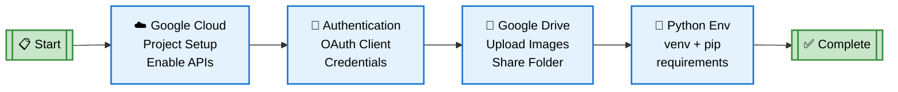
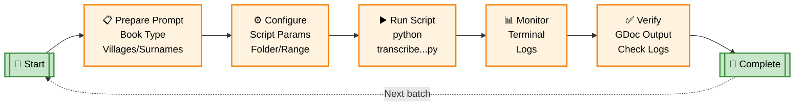
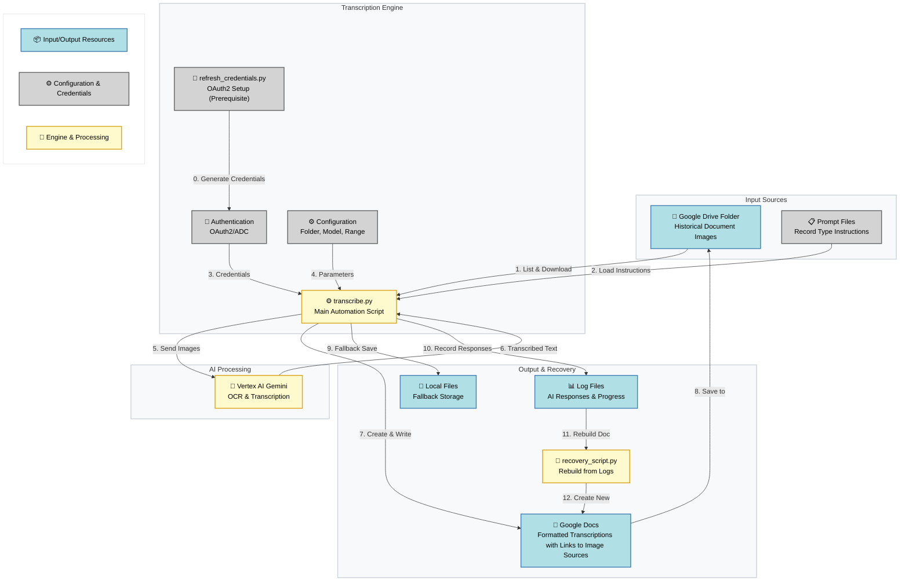
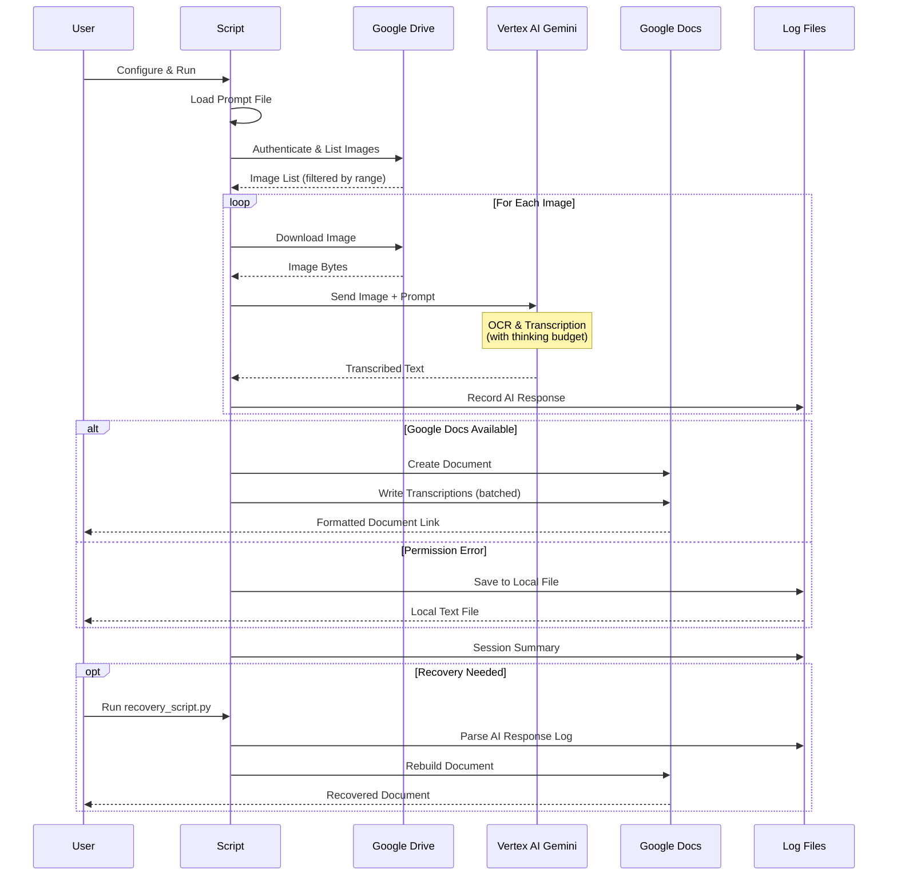

# Genea Metric Books Transcriber Scripts

This toolkit transcribes images of handwritten records from metric books stored in a Google Drive folder using Vertex AI Gemini Models and writes results into a Google Doc with page headings, source links, and persons genealogical records in multiple languages. A recovery script can rebuild the Google Doc from AI logs if the main run fails late.

## Overview

A specialized tool for transcribing handwritten genealogical records (birth, death, and marriage certificates) from 19th and 20th century Eastern European archives. The script automates the process of extracting structured data from historical documents using Google's latest Vertex AI vision models.

### Key Features

- **Flexible Image Processing**: Supports multiple filename patterns (numbered, timestamped, prefixed)
- **Configurable Prompts**: Uses external prompt files for different record types (births, deaths, marriages)
- **Batch Processing**: Process specific ranges of images with configurable start/count parameters
- **Incremental Document Writing**: Creates Google Doc after first batch, then appends subsequent batches incrementally for resilience
- **Smart Error Recovery**: Local file fallback when Google Docs API fails, with resume information logged on failures
- **Comprehensive Logging**: Separate logs for script progress and AI responses
- **Retry Mechanism**: Reprocess specific failed images without re-running entire batch
- **Rate Limiting**: Built-in protection against API quota exhaustion
- **Structured Output**: Creates well-formatted Google Docs with metadata, headings, and source links

### Example: Input → Output

**Input Image** (19th century Latin metric book record):


**Output Transcription** (Multilingual structured format):

```
Год 1894
Державний Архів Тернопільської Області - Ф. 487, оп. 1, спр. 545
Страница 22

---

### Запись 1: Николай Чепесюк
Турильче (?), дом 24
Николай Чепесюк (род. 18/03/1894)
Родители: Гавриил Чепесюк (сын Максимилиана Чепесюка и Анны Чомулы) и Мария 
  (дочь Ивана Павлюка и Ирины Романюк).
Кумы: Терентий Павлюк и Мария, жена Николая Павлюка.
Заметка: Крестил священник Иосиф Балко. Повитуха Параскева Демкив.

Турильче (?), будинок 24
Микола Чепесюк (нар. 18/03/1894)
Батьки: Гаврило Чепесюк (син Максиміліана Чепесюка та Анни Чомули) та Марія 
  (дочка Івана Павлюка та Ірини Романюк).
Куми: Терентій Павлюк та Марія, дружина Миколи Павлюка.
Замітка: Хрестив священик Йосип Балко. Баба-повитуха Параскева Демків.

Turilcze, domus 24
18 18 Martii 1894 | domus 24 | Nicolaus | Catholicus | Puer | Legitimi |
Parentes: Gabriel filius Maximiliani Czepesiuk et Annae Ciomula; 
  Maria filia Joannis Pawluk et Irenae Romanjuk. agricolae.
Patrini: Terentius Pawluk et Maria uxor Nicolai Pawluk. agricolae.
Notes: Obstetrix non approbata Parasceva Demkiw. 
  Baptisavit confirmavitque Josephus Balko parochus.
```

The AI model extracts and transcribes the same record in **Russian, Ukrainian, and Latin**, preserving names, dates, relationships, and historical context from the original handwritten document.

### Prerequisites & Project Setup Flow

Before using the transcription scripts, you must complete a one-time setup process. This includes configuring Google Cloud project with required APIs, setting up authentication, preparing Google Drive folder with metric book images, and installing Python dependencies. The diagram below outlines the sequential steps needed to prepare your environment.



### Transcription Setup & Execution Flow

Once the prerequisites are complete, you can run transcription sessions repeatedly for different metric books. For each transcription batch, you'll prepare a context-specific prompt file with village names and surnames, configure the script parameters to point to your Drive folder and image range, execute the script, and monitor the results. This workflow can be repeated for each new metric book you want to process.



### Architecture



### Main Workflow



### Component Details

| Component | Purpose | Technology |
|-----------|---------|------------|
| **Image Sources** | Historical document scans | Google Drive folders |
| **OAuth2 Setup** | Generate authentication credentials | refresh_credentials.py |
| **Transcription Engine** | Main automation script | Python 3.10+ |
| **AI Model** | OCR & structured extraction | Vertex AI Gemini 2.5/3 Pro |
| **Output Storage** | Formatted transcriptions | Google Docs API |
| **Fallback Storage** | Local file save on API errors | Text files in logs/ |
| **Logging System** | Progress tracking & recovery | Separate log files |
| **Prompt System** | Record-type specific instructions | External .txt files |
| **Recovery Tool** | Rebuild docs from logs | recovery_script.py |

## Prerequisites

1. Python 3.10+
2. Google Cloud project (e.g., `ukr-transcribe-genea`) with APIs enabled:
   - Vertex AI API
   - Google Drive API
   - Google Docs API
3. Authentication (pick one):
   - gcloud ADC (recommended):
     - `gcloud auth application-default login --project=<PROJECT_ID> --scopes=https://www.googleapis.com/auth/drive,https://www.googleapis.com/auth/documents,https://www.googleapis.com/auth/cloud-platform`
     - This writes `application_default_credentials.json` used by the scripts.
   - OAuth client via built-in helper:
     - Place your OAuth client as `client_secret.json` in the project root.
     - Run `python refresh_credentials.py` (generates `application_default_credentials.json`).
4. Drive access:
   - Share the target Drive folder (configured via `drive_folder_id` in config) with the same Google account that authenticated (Editor).

## Installation

```bash
cd /Users/<you>/repos/personalprojects/genea_gcloud_gemini_transcriber
python3 -m venv venv
source venv/bin/activate
pip install -r requirements.txt
```

## Configuration

### 1. Prepare Prompt File

Before configuring the script, create or select a prompt file in the [`prompts/`](prompts/) folder. The prompt file defines the transcription instructions, village names, and common surnames for your specific metric book.

**Note:** Use one of the existing prompt samples as a template and adjust it for your use case:
- [`INSTRUCTION_TEMERIVTSY.txt`](prompts/INSTRUCTION_TEMERIVTSY.txt) - Example for Temerivtsy villages
- [`INSTRUCTION_VERBIVKA_Ф487О1Д545_рожд.txt`](prompts/INSTRUCTION_VERBIVKA_Ф487О1Д545_рожд.txt) - Example for Verbivka births
- [`VOVKIVTSY_Ф487О1Д25_рожд.txt`](prompts/VOVKIVTSY_Ф487О1Д25_рожд.txt) - Example for Vovkivtsy birth records
- [`VOVKIVTSY_Ф487О1Д26_браки.txt`](prompts/VOVKIVTSY_Ф487О1Д26_браки.txt) - Example for Vovkivtsy marriage records
- [`INSTRUCTION.txt`](prompts/INSTRUCTION.txt) - General template

Customize the prompt with:
- Village names specific to your metric book
- Common surnames found in those villages
- Date ranges and archive references
- Record type (births, deaths, marriages)

### 2. Configure Script Parameters

Create a configuration file in the `config/` folder. Copy the example template and customize it:

```bash
cp config/config.yaml.example config/my-project.yaml
```

Then edit `config/my-project.yaml` with your settings:

```yaml
# Prompt configuration - point to your custom prompt file
prompt_file: "NIWRA_f487o1s47.md"

# Google Cloud and Drive settings
project_id: "ukr-transcribe-genea"  # or your project
drive_folder_id: "<your_drive_folder_id>"
document_name: "<your_document_name>"  # Optional: if not provided, will be fetched from Google Drive folder name
archive_index: "ф201оп4Aспр350"  # Condensed archive reference (e.g., "ф487оп1спр545")
                                  # Used for document headers and record links (format: ф[FOND]оп[OPIS]спр[DELO])
region: "global"  # you can also try "us-central1"
ocr_model_id: "gemini-3-flash-preview"  # OCR Model ID for Gemini
adc_file: "application_default_credentials.json"  # ADC file with refresh token

# Processing settings
image_start_number: 1  # Starting image number (refers to number in filename, not position)
image_count: 120  # Number of images to process starting from image_start_number
batch_size_for_doc: 10  # Number of images to transcribe before creating/writing to Google Doc (for resilience)
                         # Script creates doc after first batch, then appends subsequent batches incrementally
                         # If processing fails, only current batch is lost - resume with new image_start_number
max_images: 1000  # Maximum number of images to fetch from Google Drive

# Retry mode
retry_mode: false  # Set to true to retry specific failed images
retry_image_list: []  # List of image filenames to retry (only used when retry_mode is true)
```

**Archive Index (`archive_index`):** Optional condensed archive reference used for:
- Document page headers (format: `{archive_index}стр{page_number}`, e.g., "ф201оп4Aспр350стр22")
- Clickable archive references appended to record headers (lines starting with `###`)
- Overview section metadata

If not set, the script falls back to using image filenames for headers. The format should be: `ф[FOND]оп[OPIS]спр[DELO]` (e.g., "ф487оп1спр545" for Fond 487, Opis 1, Delo 545).

Filename patterns supported:
- `image (N).jpg/jpeg` (e.g., `image (7).jpg`)
- `imageNNNNN.jpg/jpeg` (e.g., `image00101.jpg`)
- `NNNNN.jpg/jpeg` (e.g., `216.jpg`)
- `image - YYYY-MM-DDTHHMMSS.mmm.jpg/jpeg`
- `PREFIX_NNNNN.jpg/jpeg` (e.g., `004933159_00216.jpeg`)

If no numeric/timestamp match is found, the script falls back to selecting by position (based on sorted Drive listing).

## Usage

```bash
source venv/bin/activate
python3 transcribe.py config/my-project.yaml
```

The script will:
- List images in the folder
- Process images in batches (configurable via `batch_size_for_doc` in config)
- Download and send each image to Vertex AI for transcription
- Create a Google Doc after the first batch completes, then append subsequent batches incrementally
- Log AI responses to `logs/<timestamp>-ai-responses.log`
- On failure, log resume information (next `image_start_number` to continue from)

## Output

- One Google Doc per run with:
  - Page header: Archive index + page number (e.g., "ф201оп4Aспр350стр22") if `ARCHIVE_INDEX` is set, otherwise image filename
  - Clickable source image link (format: "Src Img Url: {image_name}")
  - Raw transcription text with clickable archive references on record headers (lines starting with `###`)
  - Overview section with folder link, archive index, and processing metadata
- Logs:
  - `transcription_*.log` (script progress)
  - `logs/*-ai-responses.log` (full AI responses per image, including archive index in session config)

## Error Handling and Retry Logic

The script includes comprehensive error handling with automatic retries and exponential backoff for API calls:

### Vertex AI API Timeouts and Retries
- **Initial timeout**: 1 minute (60 seconds)
- **Retry attempts**: 3 total attempts with exponential backoff
- **Timeout progression**: 1 min → 2 min → 5 min
- **Retry delay**: 30 seconds between attempts (doubles with each retry)
- Handles `TimeoutError`, `ConnectionError`, and `OSError` with automatic retries

### Google Docs API Timeouts and Retries
- **Base timeout**: 5 minutes (300 seconds) configured for all Google Docs API calls
- **Overview update retries**: 3 attempts with exponential backoff for updating the TRANSCRIPTION RUN SUMMARY section
- **Timeout progression**: 1 min → 2 min → 5 min
- **Retry delay**: 30 seconds between attempts (doubles with each retry)
- Handles `TimeoutError`, `HttpError`, `ConnectionError`, and `OSError` with automatic retries

### Error Recovery
- Failed API calls are automatically retried with increasing timeouts
- All retry attempts are logged with attempt numbers and elapsed times
- If all retries are exhausted, the script logs detailed error information and continues to the next image
- Resume information is logged on failures, indicating the correct `image_start_number` to use for resuming

## Troubleshooting

### Authentication / OAuth Issues

#### 403 access_denied or "app not verified"
- If using OAuth client and you see “app not verified” / `access_denied`, either add your account as a Test User on the OAuth consent screen or use the gcloud ADC method (recommended).

#### Token expired or invalid_grant errors
- **Verify OAuth client file**: Ensure `client_secret.json` belongs to the correct Google Cloud project and matches the Google account you're authenticating with. Using a client secret from a different project/account will cause authentication failures.
- **Refresh credentials**: Run `python refresh_credentials.py` to generate new credentials.
- **Alternative**: Use gcloud ADC method (see Prerequisites section above) which doesn't require OAuth client files.

### Vertex AI first call is slow (cold start)
- First call can take minutes. To reduce:
  - Add a warm-up call after client init (tiny text request).
  - Lower `max_output_tokens`, remove/disable thinking config, reduce timeout and add retries.

### No images found
- Verify `drive_folder_id` in your config file and folder sharing.
- Confirm filenames match supported patterns.
- Use fallback by position via `image_start_number`/`image_count`.

### Processing interrupted or failed
- The script processes images in batches and writes incrementally to the Google Doc.
- If processing fails, check the logs for "RESUME INFO" messages indicating the next `image_start_number` to use.
- Update `image_start_number` in your config YAML file and re-run to resume from where it left off.
- Completed batches are already saved in the Google Doc, so only the current batch needs to be reprocessed.

### Google Docs: Precondition check failed / 400 on batchUpdate
- The main script writes in small chunks; if a run still fails late or the Doc is partial, use the Recovery Script below to rebuild from the AI log without re-running transcription.

### Recovery Script (rebuild GDoc from AI log)

If the main script failed after transcription, run:

```bash
source venv/bin/activate
python3 recovery_script.py logs/<your_ai_log>.log --doc-title "transcription_<label>_recovered"
# optionally place into a specific folder
python3 recovery_script.py logs/<your_ai_log>.log --folder-id <DRIVE_FOLDER_ID> --doc-title "transcription_<label>_recovered"
```

The recovery script parses the AI response log, then writes the document per image using small, safe updates to avoid index/range errors.

## Notes

- For very large runs, chunking is enforced to stay within Google Docs API limits.
- All operations are logged; tail logs for live status:
  - `tail -f transcription_*.log`
  - `tail -f logs/*-ai-responses.log`