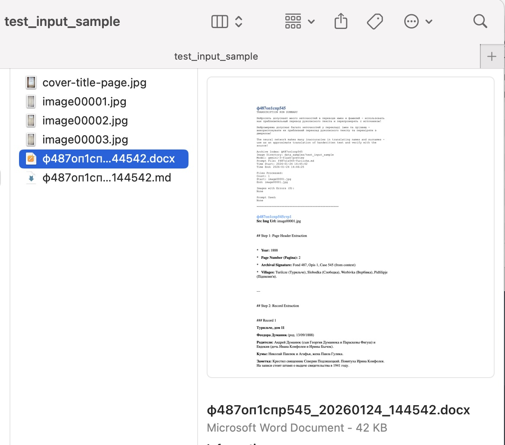

# Genea Metric Books Transcriber Scripts

This toolkit transcribes images of handwritten records from metric books using Google's Gemini AI models. The tool supports **two operation modes**:

- **LOCAL Mode**: Process images from your local file system using Gemini Developer API (no Google Cloud setup required)
- **GOOGLECLOUD Mode**: Process images from Google Drive using Vertex AI and write results to Google Docs (original functionality)

A recovery script can rebuild the Google Doc from AI logs if the main run fails late.

## Overview

A specialized tool for transcribing handwritten genealogical records (birth, death, and marriage certificates) from 19th and 20th century Eastern European archives. The script automates the process of extracting structured data from historical documents using Google's latest Gemini AI vision models.

### Quick Start (Windows)

**New to Python?** Follow these steps to get started:

1. **Download the project:**
   - Go to https://github.com/dekochka/genea-metric-books-transcriber-scripts
   - Click "Code" → "Download ZIP"
   - Extract the ZIP file to a folder (e.g., `C:\Users\YourName\Documents\genea-transcriber\`)

2. **Install Python:**
   - See [Python Installation Instructions](#python-installation-instructions) below for detailed Windows setup
   - Download Python 3.10+ from https://www.python.org/downloads/
   - **Important:** Check "Add Python to PATH" during installation

3. **Set up the project:**
   - Open PowerShell in the project folder
   - Run: `python -m venv venv`
   - Activate: `.\venv\Scripts\Activate.ps1` (or use Command Prompt: `venv\Scripts\activate`)
   - Install dependencies: `pip install -r requirements.txt`

4. **Get your API key:**
   - Go to https://aistudio.google.com/api-keys
   - Create and copy your API key

5. **Run the wizard:**
   - `python transcribe.py`
   - Follow the interactive prompts

For detailed installation instructions, see [Python Installation Instructions](#python-installation-instructions) section.

---

**Wizard Mode (Recommended - Interactive Configuration - Default):**
1. Get a Gemini API key from [Google AI Studio](https://aistudio.google.com/api-keys) - **No Google Cloud setup needed!**
2. Run: `python transcribe.py` (wizard mode is the default)
3. Follow the interactive prompts to:
   - Select processing mode (LOCAL or GOOGLECLOUD)
   - Choose image directory/Drive folder
   - Optionally extract context from title page image
   - Enter document information (villages, surnames, archive reference)
   - Configure processing settings
4. The wizard generates a configuration file and validates it before processing
5. Monitor progress: Check logs in `logs/` directory and output files

**LOCAL Mode (Manual Configuration):**
1. Get a Gemini API key from [Google AI Studio](https://aistudio.google.com/app/apikey) - **No Google Cloud setup needed!**
2. Set environment variable: `$env:GEMINI_API_KEY="your-key"` (PowerShell) or `set GEMINI_API_KEY=your-key` (Command Prompt)
3. Copy example config: `copy config\config.local.example.yaml config\my-config.yaml` (Windows)
4. Edit config with your image directory path
5. **Prepare prompt file** - See [Prompt File Configuration](#1-prepare-prompt-file) for details. **Important**: The prompt file significantly impacts transcription quality and precision. Customize it with village names, common surnames, and record type specifics for your metric book.
6. Run: `python transcribe.py config\my-config.yaml`
7. Monitor progress: Check logs in `logs/` directory and output files (Markdown, Word) in your image directory

**GOOGLECLOUD Mode (Advanced - Full Google Integration with GDoc and GDrive):**
1. Set up Google Cloud project with required APIs
2. Authenticate using gcloud ADC or OAuth
3. Copy example config: `copy config\config.googlecloud.example.yaml config\my-config.yaml` (Windows)
4. Edit config with your Drive folder ID
5. **Prepare prompt file** - See [Prompt File Configuration](#1-prepare-prompt-file) for details. **Important**: The prompt file significantly impacts transcription quality and precision. Customize it with village names, common surnames, and record type specifics for your metric book.
6. Run: `python transcribe.py config\my-config.yaml`
7. Monitor progress: Check logs in `logs/` directory and the Google Doc in your Drive folder

See [Configuration](#configuration) section for detailed setup instructions.

### Key Features

- **Interactive Wizard Mode**: Guided configuration setup with title page context extraction (NEW!)
- **Dual-Mode Operation**: Choose between LOCAL mode (simpler setup, local files) or GOOGLECLOUD mode (full Google integration)
- **Flexible Image Processing**: Supports multiple filename patterns (numbered, timestamped, prefixed)
- **Configurable Prompts**: Uses external prompt files for different record types (births, deaths, marriages)
- **Batch Processing**: Process specific ranges of images with configurable start/count parameters
- **Multiple Output Formats**: 
  - **LOCAL Mode**: Log files, Markdown files, and Word documents with transcriptions and session metadata (all saved in source image directory)
  - **GOOGLECLOUD Mode**: Google Docs with formatted transcriptions, metadata, headings, and source links
- **Incremental Document Writing** (GOOGLECLOUD mode): Creates Google Doc after first batch, then appends subsequent batches incrementally for resilience
- **Smart Error Recovery**: Automatic retries with exponential backoff, local file fallback, and resume information
- **Comprehensive Logging**: Separate logs for script progress and AI responses
- **Retry Mechanism**: Reprocess specific failed images without re-running entire batch
- **Rate Limiting**: Built-in protection against API quota exhaustion

### Example: Input → Output

#### LOCAL Mode Output

**Input: Local Image Directory** (Images of historical metric book records):

The script processes images from a local directory containing scanned pages from historical metric books (birth, death, and marriage records).

**Output: Multiple Formats** (All saved in the source image directory):

1. **Markdown File** (`.md`): Structured markdown with formatted transcriptions
   - Example: [`ф487оп1спр526_20260126_081844.md`](data_samples/test_input_sample/ф487оп1спр526_20260126_081844.md)
   - Session overview with metadata
   - Formatted transcriptions with proper newlines
   - Source image links

2. **Word Document** (`.docx`): Microsoft Word document with formatted transcriptions
   - Example: [`ф487оп1спр526_20260126_081844.docx`](data_samples/test_input_sample/ф487оп1спр526_20260126_081844.docx)
   - Bold text formatting for emphasized terms
   - Page-numbered headers (e.g., ф487оп1спр526-стр1)
   - Session metadata and overview

3. **Log File** (`.log`): Detailed transcription log with session metadata (saved in `logs/` directory)

**LOCAL Mode Output Example:**



The LOCAL mode creates formatted Word documents and Markdown files with:
- Session overview with transcription metadata
- Formatted transcriptions in Russian, Ukrainian, and Latin
- Source image links
- Page-numbered headers with archive references

#### GOOGLECLOUD Mode Output

**Input: Google Drive Folder** (Images of historical metric book records):


The script processes images from a Google Drive folder containing scanned pages from historical metric books (birth, death, and marriage records).

**Output: Complete Transcription Document** - [ДАТО ф487о1с545 1894 Турильче Вербівки народж.pdf](data_samples/ДАТО%20ф487о1с545%201894%20Турильче%20Вербівки%20народж.pdf) - Example of a complete transcribed document exported from Google Docs.

**Output: Google Doc Title Page** (Document header with title page image and transcription):


The script creates a Google Doc with:
- Document title with transcription date
- Title page image (if configured) with its transcription
- Transcription run summary with metadata

**Output: Transcribed Record** (Structured multilingual transcription):


Each record is transcribed in **Russian, Ukrainian, and Latin**, preserving:
- Names, dates, and relationships
- Historical context from the original handwritten document
- Clickable links to source images
- Archive references (if configured)

**Sample Input Record** (19th century Latin metric book record):


**Sample Output Transcription** (Text format):

```
Год 1894
Державний Архів Тернопільської Області - Ф. 487, оп. 1, спр. 545
Страница 22

---

### Запись 1: Николай Чепесюк
Турильче (?), дом 24
Николай Чепесюк (род. 18/03/1894)
Родители: Гавриил Чепесюк (сын Максимилиана Чепесюка и Анны Чомулы) и Мария 
  (дочь Ивана Павлюка и Ирины Романюк).
Кумы: Терентий Павлюк и Мария, жена Николая Павлюка.
Заметка: Крестил священник Иосиф Балко. Повитуха Параскева Демкив.

Турильче (?), будинок 24
Микола Чепесюк (нар. 18/03/1894)
Батьки: Гаврило Чепесюк (син Максиміліана Чепесюка та Анни Чомули) та Марія 
  (дочка Івана Павлюка та Ірини Романюк).
Куми: Терентій Павлюк та Марія, дружина Миколи Павлюка.
Замітка: Хрестив священик Йосип Балко. Баба-повитуха Параскева Демків.

Turilcze, domus 24
18 18 Martii 1894 | domus 24 | Nicolaus | Catholicus | Puer | Legitimi |
Parentes: Gabriel filius Maximiliani Czepesiuk et Annae Ciomula; 
  Maria filia Joannis Pawluk et Irenae Romanjuk. agricolae.
Patrini: Terentius Pawluk et Maria uxor Nicolai Pawluk. agricolae.
Notes: Obstetrix non approbata Parasceva Demkiw. 
  Baptisavit confirmavitque Josephus Balko parochus.
```

The AI model extracts and transcribes the same record in **Russian, Ukrainian, and Latin**, preserving names, dates, relationships, and historical context from the original handwritten document.

### Architecture & Technical Details

> **📐 Technical Documentation**: For detailed architecture diagrams, workflow sequences, component details, and dual-mode architecture information, see [docs/ARCHITECTURE.md](docs/ARCHITECTURE.md).

The tool uses a **Strategy pattern architecture** to support dual-mode operation:
- **LOCAL Mode**: Processes images from local file system using Gemini Developer API
- **GOOGLECLOUD Mode**: Processes images from Google Drive using Vertex AI

Key components:
- **ModeFactory**: Creates mode-specific handlers based on configuration
- **Strategy Interfaces**: Authentication, Image Sources, AI Clients, Output
- **Automatic Mode Detection**: Analyzes configuration to determine operation mode
- **Unified Processing Logic**: Shared code with mode-specific implementations

See the [Architecture Documentation](docs/ARCHITECTURE.md) for:
- Detailed architecture diagrams
- Workflow sequence diagrams for both modes
- Component details and technology stack
- Strategy pattern implementation details

## Prerequisites

### Common Requirements (Both Modes)
1. Python 3.10+
2. Install dependencies: `pip install -r requirements.txt`

### LOCAL Mode Prerequisites (Recommended - Simplest Setup)

**LOCAL mode is the easiest way to get started** - no Google Cloud setup required!

1. **Gemini API Key**: Get your free API key from [Google AI Studio](https://aistudio.google.com/app/apikey)
   - No credit card required for basic usage
   - Free tier includes generous daily limits
   - Takes less than 2 minutes to get started
2. **Local Image Directory**: Prepare a directory with images to transcribe (JPG/JPEG files)
3. **That's it!** No Google Cloud project, no OAuth setup, no complex configuration

**Why choose LOCAL mode?**
- ✅ Fastest setup (5-10 minutes vs 1-2 hours)
- ✅ No Google Cloud project needed
- ✅ No billing account required
- ✅ Works offline after initial setup
- ✅ Multiple output formats (Log, Markdown, Word)
- ✅ Perfect for testing and small projects

### GOOGLECLOUD Mode Prerequisites (Advanced - Full Google Integration)
1. **Google Cloud project** (e.g., `ukr-transcribe-genea`) with APIs enabled:
   - Vertex AI API
   - Google Drive API
   - Google Docs API
2. **Authentication** (pick one):
   - **gcloud ADC** (recommended):
     ```bash
     gcloud auth application-default login --project=<PROJECT_ID> \
       --scopes=https://www.googleapis.com/auth/drive,\
       https://www.googleapis.com/auth/documents,\
       https://www.googleapis.com/auth/cloud-platform
     ```
     This writes `application_default_credentials.json` used by the scripts.
   - **OAuth client** via built-in helper:
     - **Create OAuth 2.0 client in Google Cloud Console**:
       1. Go to https://console.cloud.google.com/
       2. Select your project (e.g., `ukr-transcribe-genea`)
       3. Navigate to **APIs & Services** → **Credentials**
       4. Click **+ CREATE CREDENTIALS** → **OAuth client ID**
       5. If prompted to configure OAuth consent screen:
          - Select **External**
          - Fill required fields (App name, User support email, Developer contact email)
          - Click **Save and Continue**
          - In **Scopes** section, click **Add or Remove Scopes** and add:
            - `https://www.googleapis.com/auth/drive`
            - `https://www.googleapis.com/auth/documents`
            - `https://www.googleapis.com/auth/cloud-platform`
          - Click **Save and Continue**
          - In **Test users** section, add your Google email as a test user
          - Click **Save and Continue** → **Back to Dashboard**
       6. Return to **Credentials** → **+ CREATE CREDENTIALS** → **OAuth client ID**
       7. Select **Application type**: **Desktop app**
       8. Enter a name (e.g., "Transcription Tool")
       9. Click **Create**
       10. Click **Download JSON** - file downloads as `client_secret_XXXXX.json`
     - **Place the client file in project root**:
       - Rename downloaded file to `client_secret.json`
       - Copy `client_secret.json` to project root (where `transcribe.py` is located)
     - **Run the helper script**:
       ```bash
       python refresh_credentials.py
       ```
       This opens a browser for authentication and generates `application_default_credentials.json`.
3. **Drive access**:
   - Share the target Drive folder (configured via `drive_folder_id` in config) with the same Google account that authenticated (Editor).

## Cost and Pricing

### What are Tokens?

Tokens are units of measurement for the volume of text processed by the AI. One token is approximately equal to 0.75 words in Ukrainian/Russian.

### Processing Costs

The tool uses the **Gemini 3 Flash Preview** model from Google. Processing costs (as of January 2026):

- **Input tokens** (images + instructions): **$0.15 per 1 million tokens**
- **Output tokens** (transcription): **$0.60 per 1 million tokens**
- **Cached tokens** (reuse): **$0.03 per 1 million tokens**

> **Note**: Pricing estimates are current as of January 2026. For the latest pricing information, see the [official Google Gemini API pricing page](https://ai.google.dev/gemini-api/docs/pricing).

### Cost Calculation Example

For **one metric book page**:
- Input tokens: ~6,000-6,500 tokens (image + instructions)
- Output tokens: ~4,000-4,600 tokens (detailed transcription)
- **Approximate cost per page: ~$0.0035-0.004** (approximately $0.004)

For **100 pages**:
- **Approximate cost: ~$0.40**

### Important Notes on Costs

1. **LOCAL Mode**: Pay-per-use with free tier available (no credit card required for basic usage)
2. **GOOGLECLOUD Mode**: First $300 free - Google provides a $300 free credit for new Google Cloud users
3. **Cost displayed in logs**: After each transcription session, you'll see the exact cost
4. **Controllable**: You can limit the number of processed images through configuration

## Installation

### Python Installation Instructions

#### Windows Installation

1. **Download Python:**
   - Go to https://www.python.org/downloads/
   - Click "Download Python 3.12.x" (or latest version)
   - The installer will download (about 25 MB)

2. **Install Python:**
   - Double-click the downloaded file (e.g., `python-3.12.0-amd64.exe`)
   - **⚠️ IMPORTANT:** Check the box "Add Python to PATH" at the bottom
   - Click "Install Now"
   - Wait for installation to complete (1-2 minutes)
   - Click "Close" when done

3. **Verify Installation:**
   - Press `Win + R`, type `cmd`, press Enter
   - Type: `python --version`
   - You should see: `Python 3.12.x` (or similar)
   - ✅ If you see a version number, Python is installed correctly
   - ❌ If you see "not recognized", Python wasn't added to PATH - reinstall with "Add Python to PATH" checked

**Alternative:** If `python` doesn't work, try `py` or `python3`:
```cmd
py --version
```

#### macOS/Linux Installation

**macOS:**
- Open Terminal
- Type: `brew install python3` (if you have Homebrew)
- Or download from https://www.python.org/downloads/macos/

**Linux:**
```bash
sudo apt update
sudo apt install python3 python3-venv python3-pip
```

### Project Setup

**Windows (PowerShell or Command Prompt):**
```powershell
# Navigate to project folder
cd C:\Users\YourName\Documents\genea-transcriber

# Create virtual environment
python -m venv venv

# Activate virtual environment
# PowerShell:
.\venv\Scripts\Activate.ps1
# OR Command Prompt:
venv\Scripts\activate

# Install dependencies
pip install -r requirements.txt
```

**macOS/Linux (Terminal):**
```bash
cd /path/to/genea-transcriber
python3 -m venv venv
source venv/bin/activate
pip install -r requirements.txt
```

### Troubleshooting

#### "Python is not recognized" (Windows)
- **Problem:** Python wasn't added to PATH during installation
- **Solution:** 
  1. Uninstall Python (Settings → Apps → Python → Uninstall)
  2. Reinstall Python, making sure to check "Add Python to PATH"
  3. Restart your computer
  4. Try again

#### PowerShell Execution Policy Error (Windows)
- **Error:** "cannot be loaded because running scripts is disabled"
- **Quick Fix:** Use Command Prompt instead of PowerShell:
  ```cmd
  venv\Scripts\activate
  ```
- **Permanent Fix:** Run PowerShell as Administrator:
  ```powershell
  Set-ExecutionPolicy -ExecutionPolicy RemoteSigned -Scope CurrentUser
  ```

#### "pip is not recognized"
- **Problem:** pip wasn't installed or PATH issue
- **Solution:**
  1. Make sure Python was installed with "pip" option checked (it's checked by default)
  2. Try: `python -m pip install -r requirements.txt` instead
  3. If that doesn't work, reinstall Python with "Add Python to PATH" checked

## Configuration

> **📖 Detailed Configuration Guide**: See [docs/CONFIGURATION.md](docs/CONFIGURATION.md) for comprehensive configuration options and examples.  
> **🔄 Migrating from Legacy Config?**: See [docs/MIGRATION.md](docs/MIGRATION.md) for step-by-step migration instructions.

### Mode Selection

The tool supports two operation modes:

- **LOCAL Mode** (Recommended for most users): Process images from local file system
  - **Best for**: Quick testing, local processing, getting started quickly
  - **Setup**: Just need Gemini API key from Google AI Studio (no Google Cloud setup)
  - **Output**: Log files, Markdown files, and Word documents (all saved in source image directory)
  - **Time to setup**: 5-10 minutes
  - **Cost**: Pay-per-use with free tier available

- **GOOGLECLOUD Mode** (Advanced): Process images from Google Drive, output to Google Docs
  - **Best for**: Production use, collaborative workflows, Google integration, large-scale projects
  - **Setup**: Requires Google Cloud project, authentication, and API enablement
  - **Output**: Formatted Google Docs with links and metadata
  - **Time to setup**: 1-2 hours
  - **Cost**: Google Cloud billing (first $300 free for new users)

The mode is automatically detected from your configuration, or you can explicitly set `mode: "local"` or `mode: "googlecloud"`.

### 1. Prepare Prompt File

**⚠️ CRITICAL: Prompt file quality significantly impacts transcription accuracy and precision!**

Before configuring the script, create or select a prompt file in the [`prompts/`](prompts/) folder. The prompt file defines the transcription instructions, village names, and common surnames for your specific metric book.

**Why it matters:**
- A well-configured prompt file can improve name, surname, and date recognition accuracy by 30-50%
- The AI uses context from the prompt to better interpret handwritten text
- Specific village names and surnames help the model recognize variations in handwriting

**Steps:**
1. Use one of the existing prompt samples as a template:
   - [`NIWRA_f487o1s47.md`](prompts/NIWRA_f487o1s47.md) - Example for Niwra village birth records (1860-1876)
   - [`f487o1s545-Turilche.md`](prompts/f487o1s545-Turilche.md) - Example for Turilche village birth records (1888-1924)

2. **Customize the Context section** with:
   - **Village names** specific to your metric book (exact spelling as it appears in records)
   - **Common surnames** found in those villages (helps with handwriting recognition)
   - **Date ranges** and archive references
   - **Record type** (births, deaths, marriages)

3. Save the customized prompt file in the `prompts/` folder

4. Reference it in your config file: `prompt_file: "your-prompt-file.md"`

**Tip:** The more specific and accurate your prompt file context is, the better the transcription results will be. Include actual village names and surnames from your metric book for best results.

### 2. Configure Script Parameters

#### LOCAL Mode Configuration

Create a configuration file using the LOCAL mode template:

```bash
cp config/config.local.example.yaml config/my-local-project.yaml
```

Edit `config/my-local-project.yaml`:

```yaml
# Set mode explicitly (optional - auto-detected if local section present)
mode: "local"

# LOCAL mode configuration
local:
  # API key (or use GEMINI_API_KEY environment variable - recommended)
  api_key: "your-api-key-here"  # Get from https://aistudio.google.com/app/apikey
  
  # Local directory containing images
  image_dir: "/path/to/your/images"
  
  # Output directory for log files (optional, default: "logs")
  output_dir: "logs"
  
  # OCR Model ID (optional, default: "gemini-3-flash-preview")
  # Available models: "gemini-3-flash-preview", "gemini-flash-latest", 
  #                   "gemini-flash-lite-latest", "gemini-3-pro-preview"
  # Note: Pro models have daily limits without a Google AI subscription
  ocr_model_id: "gemini-3-flash-preview"

# Shared configuration (applies to both modes)
prompt_file: "f487o1s545-Turilche.md"
archive_index: "ф487оп1спр545"
image_start_number: 1
image_count: 10
retry_mode: false
retry_image_list: []
```

**Security Note**: For better security, use the `GEMINI_API_KEY` environment variable instead of putting the API key in the config file:
```bash
export GEMINI_API_KEY="your-api-key-here"
```

#### GOOGLECLOUD Mode Configuration

Create a configuration file using the GOOGLECLOUD mode template:

```bash
cp config/config.googlecloud.example.yaml config/my-project.yaml
```

Edit `config/my-project.yaml`:

```yaml
# Set mode explicitly (optional - auto-detected if googlecloud section present)
mode: "googlecloud"

# GOOGLECLOUD mode configuration
googlecloud:
  project_id: "ukr-transcribe-genea"
  drive_folder_id: "<your_drive_folder_id>"
  region: "global"
  ocr_model_id: "gemini-3-flash-preview"
  adc_file: "application_default_credentials.json"
  document_name: "<your_document_name>"  # Optional
  title_page_filename: "title_page.jpg"  # Optional

# Shared configuration
prompt_file: "f487o1s545-Turilche.md"
archive_index: "ф487оп1спр545"
image_start_number: 1
image_count: 120
batch_size_for_doc: 10  # GOOGLECLOUD mode only
max_images: 1000  # GOOGLECLOUD mode only
retry_mode: false
retry_image_list: []
```

#### Legacy Configuration Format

The tool also supports the legacy flat configuration format for backward compatibility. See `config/config.yaml.example` for the legacy format. The tool will automatically detect and convert legacy configs to the new format.

**Archive Index (`archive_index`):** Optional condensed archive reference used for:
- Document page headers (format: `{archive_index}стр{page_number}`, e.g., "ф201оп4Aспр350стр22")
- Clickable archive references appended to record headers (lines starting with `###`)
- Overview section metadata

If not set, the script falls back to using image filenames for headers. The format should be: `ф[FOND]оп[OPIS]спр[DELO]` (e.g., "ф487оп1спр545" for Fond 487, Opis 1, Delo 545).

**Filename patterns supported:**
- `image (N).jpg/jpeg` (e.g., `image (7).jpg`)
- `imageNNNNN.jpg/jpeg` (e.g., `image00101.jpg`)
- `NNNNN.jpg/jpeg` (e.g., `216.jpg`)
- `image - YYYY-MM-DDTHHMMSS.mmm.jpg/jpeg`
- `PREFIX_NNNNN.jpg/jpeg` (e.g., `004933159_00216.jpeg`)

If no numeric/timestamp match is found, the script falls back to selecting by position (based on sorted listing).

## Usage

### Wizard Mode (Interactive Configuration)

The wizard mode provides an interactive, step-by-step configuration experience that eliminates the need to manually edit YAML files.

#### Starting the Wizard

Wizard mode is enabled by default. Simply run:

```bash
python3 transcribe.py
```

To use a config file instead (traditional mode):

```bash
python3 transcribe.py config/my-config.yaml
```

To explicitly disable wizard mode and require a config file:

```bash
python3 transcribe.py --wizard-off config/my-config.yaml
```

#### Wizard Steps

1. **Mode Selection**
   - Choose between LOCAL or GOOGLECLOUD mode
   - Select image directory (LOCAL) or Drive folder (GOOGLECLOUD)
   - Enter API key or use environment variable
   - Select OCR model

2. **Context Collection**
   - Optionally extract context from title page image using AI
   - Review and edit extracted information (archive reference, villages, surnames)
   - Or manually enter all context information

3. **Processing Settings**
   - Select prompt template
   - Configure image range (start number and count)
   - Set batch size (GOOGLECLOUD mode)

4. **Pre-Flight Validation**
   - Automatic validation of all settings
   - Checks API keys, paths, templates, and images
   - Option to continue despite warnings

5. **Configuration Generation**
   - Wizard generates a complete YAML configuration file
   - File is ready to use immediately
   - Can be edited manually if needed

#### Wizard Features

- **Title Page Extraction**: Automatically extracts archive reference, villages, and surnames from title page images
- **Context Separation**: Keeps prompt templates static while storing project-specific context in config
- **Validation**: Pre-flight checks catch errors before processing starts
- **Backward Compatible**: Generated configs work with existing `transcribe.py` workflow

#### Example Wizard Session

```bash
$ python3 transcribe.py

╭───────────────────────────────────────── Welcome ──────────────────────────────────────────╮
│ Genealogical Transcription Wizard                                                          │
│ This wizard will guide you through creating a configuration file.                          │
│ You can press Ctrl+C at any time to cancel.                                                 │
│                                                                                            │
╰────────────────────────────────────────────────────────────────────────────────────────────╯

Step 1/3: ModeSelectionStep

Step 1: Select Processing Mode
Choose how you want to process images:

? Select processing mode: Local (process images from local folder)
? Enter path to directory containing images: data_samples/test_input_sample
? Use GEMINI_API_KEY environment variable? No
Get your API key from: https://aistudio.google.com/api-keys
? Enter Gemini API key (or press Enter to skip and use env var): AIzaSy...XXXXX
? Enter output directory for logs (or press Enter for default 'logs'): logs
? Select OCR model: gemini-3-flash-preview (recommended)

Step 2/3: ContextCollectionStep

Context Information Collection
Provide information about the document and villages.

? Do you want to extract context from a title page image? Yes
? Select title page image (or enter manually): cover-title-page.jpg

Extracting context from title page...

Extracted Context from Title Page:
  Archive Reference: Ф. 487, оп. 1, спр. 526 (545)
  Document Type: Метрична книга про народження
  Date Range: 1888 (липень - грудень) - 1924 (січень - квітень)
  Main Villages: Турильче (Turylcze)
  Common Surnames: Rohaczuk, Didyk, Babij, Paszczuk, Lachidnick, Czepeczuk, Jakowyczyn
? What would you like to do? Accept all extracted data

Step 3/3: ProcessingSettingsStep

Step 3: Processing Settings

? Select prompt template: metric-book-birth - Role
Auto-generated archive index: ф487оп1спр526
? Enter starting image number (default: 1): 1
? Enter number of images to process: 2

✓ All steps completed successfully!
? Where should the config file be saved? config/my-project.yaml

✓ Configuration saved to: config/my-project.yaml

Running pre-flight validation...
✓ All validation checks passed!
```

#### Using Wizard-Generated Config

After the wizard generates your config file, you can use it normally:

```bash
python3 transcribe.py config/my-project.yaml
```

The generated config includes:
- All mode-specific settings
- Context section with villages, surnames, archive reference
- Prompt template reference
- Processing settings (image range, batch size, etc.)

#### Wizard vs Manual Configuration

**Use Wizard Mode when:**
- Setting up a new project
- You want to extract context from title pages
- You prefer interactive guidance
- You want to avoid YAML syntax errors

**Use Manual Configuration when:**
- You have existing configs you want to reuse
- You need to make quick edits to specific settings
- You're comfortable editing YAML files
- You want to version control your configs

### LOCAL Mode

```bash
source venv/bin/activate
# Set API key via environment variable (recommended)
export GEMINI_API_KEY="your-api-key-here"
python3 transcribe.py config/my-local-project.yaml
```

The script will:
- List images from the local directory
- Process each image sequentially
- Send each image to Gemini Developer API for transcription
- Write transcriptions to log files in the output directory
- Log AI responses to `logs/<timestamp>-ai-responses.log`
- Create a session summary at the end

### GOOGLECLOUD Mode

```bash
source venv/bin/activate
python3 transcribe.py config/my-project.yaml
```

The script will:
- List images from the Google Drive folder
- Process images in batches (configurable via `batch_size_for_doc` in config)
- Download and send each image to Vertex AI for transcription
- Create a Google Doc after the first batch completes, then append subsequent batches incrementally
- Log AI responses to `logs/<timestamp>-ai-responses.log`
- On failure, log resume information (next `image_start_number` to continue from)

## Output

### LOCAL Mode Output

LOCAL mode generates **three output files** for every transcription session:

1. **Log File** (saved in `logs/` directory):
   - `YYYYMMDD_HHMMSS-{archive_index}-transcription.log` - Main transcription log with:
     - Session metadata (start/end time, mode, configuration)
     - Transcriptions for each image with source file paths
     - Session summary with metrics (total images, success count, errors)
     - Error information and resume instructions (if errors occur)
   - `logs/YYYYMMDD_HHMMSS-ai-responses.log` - Full AI responses per image

2. **Markdown File** (saved in source image directory):
   - `{archive_index}_YYYYMMDD_HHMMSS.md` - Structured markdown file with:
     - Session overview section with metadata
     - Formatted transcriptions with proper newlines
     - Source image links (relative paths)
     - Example: [`ф487оп1спр526_20260126_081844.md`](data_samples/test_input_sample/ф487оп1спр526_20260126_081844.md)

3. **Word Document** (saved in source image directory):
   - `{archive_index}_YYYYMMDD_HHMMSS.docx` - Microsoft Word document with:
     - Session overview with metadata
     - Formatted transcriptions with bold text for emphasized terms
     - Page-numbered headers (e.g., ф487оп1спр526-стр1)
     - Example: [`ф487оп1спр526_20260126_081844.docx`](data_samples/test_input_sample/ф487оп1спр526_20260126_081844.docx)

All output files are created simultaneously during transcription, allowing you to:
- View transcriptions in your preferred format (Markdown or Word)
- Share formatted documents easily
- Keep detailed logs for reference

### GOOGLECLOUD Mode Output

- **Google Doc** per run with:
  - Document header with date (format: "{document_name} {YYYYMMDD}")
  - Title page image (if `title_page_filename` is specified in config) inserted under the header
  - Page header: Archive index + page number (e.g., "ф201оп4Aспр350стр22") if `archive_index` is set, otherwise image filename
  - Clickable source image link (format: "Src Img Url: {image_name}")
  - Raw transcription text with clickable archive references on record headers (lines starting with `###`)
  - Overview section with folder link, archive index, and processing metadata

- **Logs**:
  - `transcription_*.log` (script progress)
  - `logs/*-ai-responses.log` (full AI responses per image, including archive index in session config)

## Error Handling and Retry Logic

The script includes comprehensive error handling with automatic retries and exponential backoff for API calls:

### LOCAL Mode API Timeouts and Retries (Gemini Developer API)
- **Initial timeout**: 1 minute (60 seconds)
- **Retry attempts**: 3 total attempts with exponential backoff
- **Timeout progression**: 1 min → 2 min → 5 min
- **Retry delay**: 30 seconds between attempts (doubles with each retry: 30s → 60s → 120s)
- Handles `TimeoutError`, `ConnectionError`, `OSError`, and `ServerError` (503 Service Unavailable) with automatic retries
- On errors, output files (Markdown, Word, Log) are still created with partial results and error information

### GOOGLECLOUD Mode API Timeouts and Retries

#### Vertex AI API Timeouts and Retries
- **Initial timeout**: 1 minute (60 seconds)
- **Retry attempts**: 3 total attempts with exponential backoff
- **Timeout progression**: 1 min → 2 min → 5 min
- **Retry delay**: 30 seconds between attempts (doubles with each retry)
- Handles `TimeoutError`, `ConnectionError`, and `OSError` with automatic retries

#### Google Docs API Timeouts and Retries
- **Base timeout**: 5 minutes (300 seconds) configured for all Google Docs API calls
- **Overview update retries**: 3 attempts with exponential backoff for updating the TRANSCRIPTION RUN SUMMARY section
- **Timeout progression**: 1 min → 2 min → 5 min
- **Retry delay**: 30 seconds between attempts (doubles with each retry)
- Handles `TimeoutError`, `HttpError`, `ConnectionError`, and `OSError` with automatic retries

### Error Recovery
- Failed API calls are automatically retried with increasing timeouts
- All retry attempts are logged with attempt numbers and elapsed times
- If all retries are exhausted, the script logs detailed error information and continues to the next image
- Resume information is logged on failures, indicating the correct `image_start_number` to use for resuming

## Troubleshooting

### Authentication / OAuth Issues

#### 403 access_denied or "app not verified"
- If using OAuth client and you see “app not verified” / `access_denied`, either add your account as a Test User on the OAuth consent screen or use the gcloud ADC method (recommended).

#### Token expired or invalid_grant errors
- **Verify OAuth client file**: Ensure `client_secret.json` belongs to the correct Google Cloud project and matches the Google account you're authenticating with. Using a client secret from a different project/account will cause authentication failures.
- **Refresh credentials**: Run `python refresh_credentials.py` to generate new credentials.
- **Alternative**: Use gcloud ADC method (see Prerequisites section above) which doesn't require OAuth client files.

#### Vertex AI first call is slow (cold start)
- First call can take minutes. To reduce:
  - Add a warm-up call after client init (tiny text request).
  - Lower `max_output_tokens`, remove/disable thinking config, reduce timeout and add retries.

#### No images found
- Verify `drive_folder_id` in your config file and folder sharing.
- Confirm filenames match supported patterns.
- Use fallback by position via `image_start_number`/`image_count`.

##### Processing interrupted or failed
- The script processes images in batches and writes incrementally to the Google Doc.
- If processing fails, check the logs for "RESUME INFO" messages indicating the next `image_start_number` to use.
- Update `image_start_number` in your config YAML file and re-run to resume from where it left off.
- Completed batches are already saved in the Google Doc, so only the current batch needs to be reprocessed.

##### Google Docs: Precondition check failed / 400 on batchUpdate
- The main script writes in small chunks; if a run still fails late or the Doc is partial, use the Recovery Script below to rebuild from the AI log without re-running transcription.

##### Recovery Script (rebuild GDoc from AI log) - GOOGLECLOUD Mode Only - GOOGLECLOUD Mode Only

If the main script failed after transcription, run:

```bash
source venv/bin/activate
python3 recovery_script.py logs/<your_ai_log>.log --doc-title "transcription_<label>_recovered"
# optionally place into a specific folder
python3 recovery_script.py logs/<your_ai_log>.log --folder-id <DRIVE_FOLDER_ID> --doc-title "transcription_<label>_recovered"
```

The recovery script parses the AI response log, then writes the document per image using small, safe updates to avoid index/range errors.

**Note**: Recovery script is only available for GOOGLECLOUD mode. For LOCAL mode, transcriptions are already saved in log files and can be manually extracted if needed.

## Notes

- For very large runs, chunking is enforced to stay within Google Docs API limits.
- All operations are logged; tail logs for live status:
  - `tail -f transcription_*.log`
  - `tail -f logs/*-ai-responses.log`

## License

This project is licensed under the MIT License - see the [LICENSE](LICENSE) file for details.

## Disclaimer

**Important Legal Notice:**

This software is provided "AS IS", without warranty of any kind. The AI transcription results generated by this tool may contain errors, inaccuracies, or misinterpretations, especially with:
- Handwritten text recognition
- Historical document transcription  
- Name and surname translations
- Date and number extraction

**Users are responsible for:**
- Verifying all transcription results against original source documents
- Validating names, dates, and genealogical information
- Using transcriptions as approximate translations only
- Ensuring compliance with applicable laws and regulations

**The authors and contributors assume no liability for:**
- Errors or inaccuracies in AI-generated transcriptions
- Loss of data or information
- Incorrect genealogical research based on transcriptions
- Any consequences arising from the use of this software

**Use this software at your own risk.** Always verify AI-generated transcriptions with original source documents. The neural network makes many inaccuracies in translating names and surnames - use as an approximate translation of handwritten text and verify with the source!