# Architecture & Technical Documentation

This document provides detailed technical information about the Genea Metric Books Transcriber architecture, workflows, and component details.

## Table of Contents

- [Prerequisites & Project Setup Flow](#prerequisites--project-setup-flow)
- [Transcription Setup & Execution Flow](#transcription-setup--execution-flow)
- [Architecture Overview](#architecture-overview)
- [Main Workflow](#main-workflow)
- [Component Details](#component-details)
- [Dual-Mode Architecture](#dual-mode-architecture)

## Prerequisites & Project Setup Flow

Before using the transcription scripts, you must complete a one-time setup process. This includes configuring Google Cloud project with required APIs, setting up authentication, preparing Google Drive folder with metric book images, and installing Python dependencies. The diagram below outlines the sequential steps needed to prepare your environment.

```mermaid
graph LR
    J1_Start[["📋 Start"]]
    J1_GCP["☁️ Google Cloud<br/>Project Setup<br/>Enable APIs"]
    J1_Auth["🔐 Authentication<br/>OAuth Client<br/>Credentials"]
    J1_Drive["📁 Google Drive<br/>Upload Images<br/>Share Folder"]
    J1_Env["🐍 Python Env<br/>venv + pip<br/>requirements"]
    J1_Done[["✅ Complete"]]
    
    J1_Start --> J1_GCP --> J1_Auth --> J1_Drive --> J1_Env --> J1_Done
    
    classDef setupStyle fill:#E3F2FD,stroke:#1976D2,stroke-width:2px,color:#000
    classDef startStyle fill:#C8E6C9,stroke:#388E3C,stroke-width:2px,color:#000
    classDef endStyle fill:#C8E6C9,stroke:#388E3C,stroke-width:2px,color:#000
    
    class J1_GCP,J1_Auth,J1_Drive,J1_Env setupStyle
    class J1_Start startStyle
    class J1_Done endStyle
```

**Note**: For LOCAL mode, only Python environment setup and Gemini API key are required (no Google Cloud setup needed).

## Transcription Setup & Execution Flow

Once the prerequisites are complete, you can run transcription sessions repeatedly for different metric books. For each transcription batch, you'll prepare a context-specific prompt file with village names and surnames, configure the script parameters to point to your Drive folder and image range, execute the script, and monitor the results. This workflow can be repeated for each new metric book you want to process.

```mermaid
graph LR
    J2_Start[["📝 Start"]]
    J2_Prompt["📋 Prepare Prompt<br/>Book Type<br/>Villages/Surnames"]
    J2_Config["⚙️ Configure<br/>Script Params<br/>Folder/Range"]
    J2_Run["▶️ Run Script<br/>python<br/>transcribe...py"]
    J2_Monitor["📊 Monitor<br/>Terminal<br/>Logs"]
    J2_Verify["✅ Verify<br/>Output<br/>Check Logs"]
    J2_Done[["🎉 Complete"]]
    
    J2_Start --> J2_Prompt --> J2_Config --> J2_Run --> J2_Monitor --> J2_Verify --> J2_Done
    J2_Done -.->|"Next batch"| J2_Start
    
    classDef runStyle fill:#FFF3E0,stroke:#F57C00,stroke-width:2px,color:#000
    classDef startStyle fill:#C8E6C9,stroke:#388E3C,stroke-width:2px,color:#000
    classDef endStyle fill:#C8E6C9,stroke:#388E3C,stroke-width:2px,color:#000
    
    class J2_Prompt,J2_Config,J2_Run,J2_Monitor,J2_Verify runStyle
    class J2_Start startStyle
    class J2_Done endStyle
```

**Note**: For LOCAL mode, the workflow is similar but uses local image directories and outputs to log files instead of Google Docs.

## Architecture Overview

The tool uses a Strategy pattern architecture to support dual-mode operation (LOCAL and GOOGLECLOUD modes). The architecture diagram below shows the overall system design:

```mermaid
graph TB
    subgraph IS["Input Sources"]
        GD["📁 Google Drive Folder<br/>Historical Document Images<br/>(GOOGLECLOUD Mode)"]
        LOCAL_FS["💾 Local File System<br/>Image Directory<br/>(LOCAL Mode)"]
        PROMPTS["📋 Prompt Files<br/>Record Type Instructions"]
    end
    
    subgraph TE["Transcription Engine"]
        SCRIPT["⚙️ transcribe.py<br/>Main Automation Script"]
        MODE_FACTORY["🏭 ModeFactory<br/>Strategy Factory"]
        AUTH["🔐 Authentication<br/>OAuth2/ADC (GOOGLECLOUD)<br/>API Key (LOCAL)"]
        CONFIG["⚙️ Configuration<br/>Mode Detection<br/>Validation"]
        REFRESH["🔄 refresh_credentials.py<br/>OAuth2 Setup (Prerequisite)"]
    end
    
    subgraph STRATEGIES["Strategy Pattern"]
        AUTH_STRAT["🔐 Auth Strategies<br/>LocalAuthStrategy<br/>GoogleCloudAuthStrategy"]
        IMG_STRAT["📷 Image Source Strategies<br/>LocalImageSource<br/>DriveImageSource"]
        AI_STRAT["🤖 AI Client Strategies<br/>GeminiDevClient<br/>VertexAIClient"]
        OUT_STRAT["📄 Output Strategies<br/>LogFileOutput<br/>GoogleDocsOutput"]
    end
    
    subgraph AI["AI Processing"]
        GEMINI_DEV["🤖 Gemini Developer API<br/>(LOCAL Mode)"]
        VERTEX["🤖 Vertex AI Gemini<br/>(GOOGLECLOUD Mode)"]
    end
    
    subgraph OR["Output & Recovery"]
        GDOC["📄 Google Docs<br/>Formatted Transcriptions<br/>(GOOGLECLOUD Mode)"]
        LOGS_OUT["📝 Log Files<br/>Transcriptions & Metadata<br/>(LOCAL Mode)"]
        LOCAL["💾 Local Files<br/>Fallback Storage"]
        LOGS["📊 Log Files<br/>AI Responses & Progress"]
        RECOVERY["🔄 recovery_script.py<br/>Rebuild from Logs<br/>(GOOGLECLOUD Mode)"]
    end
    
    REFRESH -->|0. Generate Credentials| AUTH
    GD -->|1. List & Download| IMG_STRAT
    LOCAL_FS -->|1. List & Read| IMG_STRAT
    PROMPTS -->|2. Load Instructions| SCRIPT
    AUTH -->|3. Credentials| AUTH_STRAT
    CONFIG -->|4. Parameters| SCRIPT
    SCRIPT -->|5. Create Handlers| MODE_FACTORY
    MODE_FACTORY -->|6. Instantiate| STRATEGIES
    IMG_STRAT -->|7. Get Images| SCRIPT
    SCRIPT -->|8. Send Images| AI_STRAT
    AI_STRAT -->|9. LOCAL Mode| GEMINI_DEV
    AI_STRAT -->|10. GOOGLECLOUD Mode| VERTEX
    GEMINI_DEV -->|11. Transcribed Text| SCRIPT
    VERTEX -->|12. Transcribed Text| SCRIPT
    SCRIPT -->|13. Write Output| OUT_STRAT
    OUT_STRAT -->|14. GOOGLECLOUD Mode| GDOC
    OUT_STRAT -->|15. LOCAL Mode| LOGS_OUT
    GDOC -->|16. Save to| GD
    SCRIPT -->|17. Fallback Save| LOCAL
    SCRIPT -->|18. Record Responses| LOGS
    LOGS -->|19. Rebuild Doc| RECOVERY
    RECOVERY -->|20. Create New| GDOC
    
    subgraph Legend[" "]
        direction LR
        L1["📦 Input/Output Resources"]
        L2["⚙️ Configuration & Credentials"]
        L3["🔧 Engine & Processing"]
        L4["🎯 Strategy Pattern"]
    end
    
    classDef resourceStyle fill:#B0E0E6,stroke:#4682B4,stroke-width:2px,color:#000
    classDef configStyle fill:#D3D3D3,stroke:#696969,stroke-width:2px,color:#000
    classDef processingStyle fill:#FFFACD,stroke:#DAA520,stroke-width:2px,color:#000
    classDef strategyStyle fill:#E1BEE7,stroke:#7B1FA2,stroke-width:2px,color:#000
    classDef legendStyle fill:#F0F8FF,stroke:#87CEEB,stroke-width:1px,color:#000
    
    class GD,LOCAL_FS,GDOC,LOGS_OUT,LOCAL,LOGS resourceStyle
    class PROMPTS,AUTH,CONFIG,REFRESH configStyle
    class SCRIPT,MODE_FACTORY,GEMINI_DEV,VERTEX,RECOVERY processingStyle
    class AUTH_STRAT,IMG_STRAT,AI_STRAT,OUT_STRAT strategyStyle
    class L1 resourceStyle
    class L2 configStyle
    class L3 processingStyle
    class L4 strategyStyle
    
    style IS fill:#F8F9FA,stroke:#CED4DA,stroke-width:2px
    style TE fill:#F8F9FA,stroke:#CED4DA,stroke-width:2px
    style STRATEGIES fill:#F3E5F5,stroke:#9C27B0,stroke-width:2px
    style AI fill:#F8F9FA,stroke:#CED4DA,stroke-width:2px
    style OR fill:#F8F9FA,stroke:#CED4DA,stroke-width:2px
    style Legend fill:#FFFFFF,stroke:#DEE2E6,stroke-width:1px
```

## Main Workflow

The main workflow sequence diagram shows how the system processes images in both modes:

### GOOGLECLOUD Mode Workflow

### LOCAL Mode Workflow

## Component Details

| Component | Purpose | Technology | Mode |
|-----------|---------|------------|------|
| **Image Sources** | Historical document scans | Google Drive folders (GOOGLECLOUD) / Local file system (LOCAL) | Both |
| **OAuth2 Setup** | Generate authentication credentials | refresh_credentials.py | GOOGLECLOUD |
| **API Key Auth** | Simple API key authentication | Environment variable or config | LOCAL |
| **Transcription Engine** | Main automation script | Python 3.10+ | Both |
| **Mode Detection** | Auto-detect operation mode | Configuration analysis | Both |
| **Mode Factory** | Create mode-specific handlers | Strategy pattern implementation | Both |
| **AI Model (LOCAL)** | OCR & structured extraction | Gemini Developer API | LOCAL |
| **AI Model (GOOGLECLOUD)** | OCR & structured extraction | Vertex AI Gemini 2.5/3 Pro | GOOGLECLOUD |
| **Output Storage (LOCAL)** | Formatted transcriptions | Log files with metadata | LOCAL |
| **Output Storage (GOOGLECLOUD)** | Formatted transcriptions | Google Docs API | GOOGLECLOUD |
| **Fallback Storage** | Local file save on API errors | Text files in logs/ | GOOGLECLOUD |
| **Logging System** | Progress tracking & recovery | Separate log files | Both |
| **Prompt System** | Record-type specific instructions | External .txt/.md files | Both |
| **Recovery Tool** | Rebuild docs from logs | recovery_script.py | GOOGLECLOUD |

## Dual-Mode Architecture

The tool implements a Strategy pattern to support dual-mode operation:

### Strategy Interfaces

1. **AuthenticationStrategy**
   - `LocalAuthStrategy`: API key authentication
   - `GoogleCloudAuthStrategy`: OAuth2/ADC authentication

2. **ImageSourceStrategy**
   - `LocalImageSource`: Local file system image access
   - `DriveImageSource`: Google Drive image access

3. **AIClientStrategy**
   - `GeminiDevClient`: Gemini Developer API client
   - `VertexAIClient`: Vertex AI client

4. **OutputStrategy**
   - `LogFileOutput`: Log file output (LOCAL mode)
   - `GoogleDocsOutput`: Google Docs output (GOOGLECLOUD mode)

### Mode Factory

The `ModeFactory` class creates mode-specific handler instances based on the detected mode:

- **LOCAL Mode**: Creates `LocalAuthStrategy`, `LocalImageSource`, `GeminiDevClient`, `LogFileOutput`
- **GOOGLECLOUD Mode**: Creates `GoogleCloudAuthStrategy`, `DriveImageSource`, `VertexAIClient`, `GoogleDocsOutput`

### Configuration Flow

1. **Load Configuration**: Read YAML config file
2. **Detect Mode**: Analyze config structure to determine mode
3. **Normalize Config**: Convert legacy format to new format if needed
4. **Validate Config**: Check required fields and file/directory existence
5. **Create Handlers**: Use ModeFactory to instantiate mode-specific strategies
6. **Process**: Execute transcription using strategy handlers

### Processing Flow

**LOCAL Mode**:
1. List images from local directory
2. Process each image sequentially
3. Send to Gemini Developer API
4. Write transcriptions to log files
5. Generate session summary

**GOOGLECLOUD Mode**:
1. Authenticate with Google Cloud
2. List images from Google Drive
3. Process images in batches
4. Send to Vertex AI
5. Write to Google Docs incrementally
6. Update overview section

### Error Handling

Both modes implement:
- Automatic retries with exponential backoff
- Clear error messages with mode-specific guidance
- Resume information for interrupted runs
- Comprehensive logging

For more details on configuration and usage, see:
- [Configuration Guide](CONFIGURATION.md)
- [Migration Guide](MIGRATION.md)
- [Main README](../README.md)
